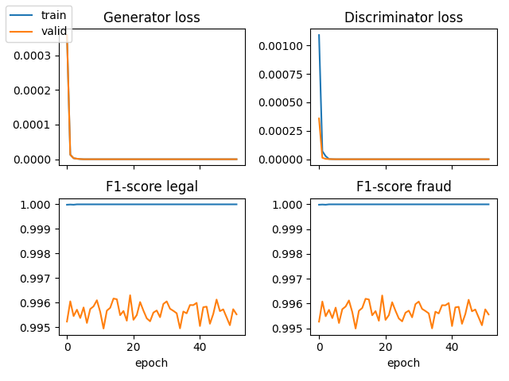

# GAN on Credit Card Fraud Detection

The data set [Credit Card Fraud Detection](https://www.kaggle.com/datasets/mlg-ulb/creditcardfraud) contains features characterising fraudulous credit card transaction.\
The challenge consists in building a machine learning model discriminating fraudulous transaction from legal ones.\

## Method
We implement a Generative Adversarial Network (GAN) with PyTorch. The generator and discriminator networks respectively have tree and two dense layers.

## Results
The GAN needs 5 training epochs
